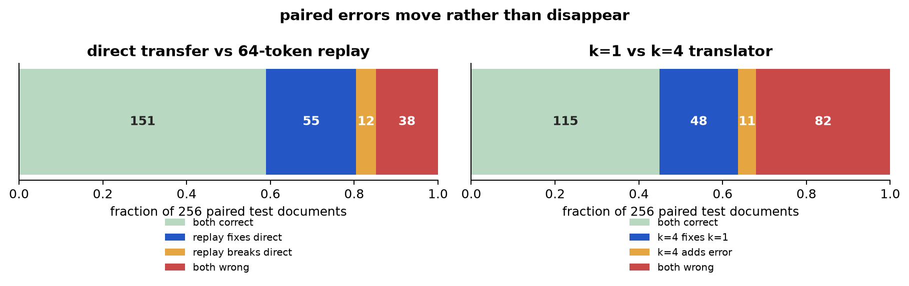
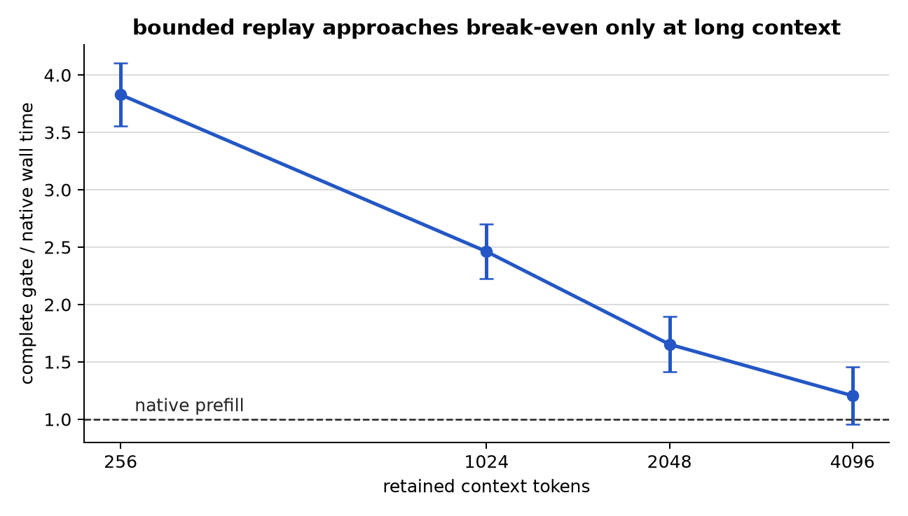

# Detailed report: what local replay tells us about cross-model KV transfer

## Bottom line

The original gate failed, but the experiments exposed a sharper research
question.

A 64-token replay score ranked harmful transfers reasonably well, but it did
not beat a much cheaper confidence score with statistical confidence. Its
accepted predictions were still wrong too often, and the complete policy was
almost four times slower than native prefill at 256 tokens. A fresh run
reproduced every non-timing result exactly and reproduced the same timing
conclusion.

The useful question is therefore no longer “does replay certify a translated
cache?” It is:

> Does the non-equivariant translation error exposed by replay add predictive
> information beyond the target model's own confidence, and under what error
> regimes and context lengths can that information pay for its computation?

Here, *non-equivariant* means that translation and model execution do not agree
about how the cached state should change after processing the same recent
tokens.

The current evidence supports a workshop paper about a carefully controlled
diagnostic and negative result. It does not yet support an ICML-level claim
that local replay is a generally useful handoff gate.

## Evidence used

All promoted runs passed their independent evidence audits.

- Primary `k=4` run:
  `20260829T195327Z-document-pilot-qwen25-15b-to-3b`.
- Paired `k=1` ablation:
  `20260829T200045Z-document-pilot-single-layer-qwen25-15b-to-3b`.
- Long-context scaling run:
  `20260829T203053Z-context-scaling-qwen25-15b-to-3b`.
- Fresh-process reproduction:
  `20260829T203748Z-document-pilot-reproduction-qwen25-15b-to-3b`.
- Post-hoc analyses are stored in `research/existing-record-analysis.json` and
  are explicitly direction-finding rather than confirmatory.

The reproduction regenerated the same data, translator archive and tensors,
all 1,536 raw evaluation records, and every non-timing summary field. Fresh
timing was 62.66 ms for the gate versus 15.75 ms for native prefill, preserving
the primary conclusion.

## Problem and mechanism

At a model handoff, the receiving model normally recomputes the complete
history to build its own KV cache. A cache translator tries to avoid that work
by mapping the source model's cache into the target model's representation.
The problem is that the system does not know whether one translated cache is
safe to use. Computing the native target cache to check would erase the saving.

For each example, the experiment constructed three routes:

1. **Native:** the target model processed the complete 256-token window.
2. **Direct transfer:** the source processed the first 255 tokens, its cache was
   translated, and the target processed the final anchor token.
3. **Replay:** an earlier source cache was translated, then the target processed
   the most recent 64 context tokens and the anchor.

The online replay score was the Jensen-Shannon divergence between the direct
and replay next-token distributions. The offline harm label was whether direct
transfer changed the native target's top-1 token. Native target state was never
available to the online gate.

The intuition is simple: if the translator preserves the state update induced
by recent tokens, translating before or after that update should give similar
target behavior. Large path disagreement can expose an error that evolves
differently in the two models.

That mechanism has a hard limit. Both paths can carry the same wrong state and
therefore agree while remaining wrong. Formally, replay observes how translation
error changes under a local transition, whereas the target action depends on
how the final error aligns with the output decision boundary. Commutation is a
consistency check, not a correctness certificate.

## Frozen question and hypotheses

The confirmatory test used Qwen2.5 1.5B Instruct as source and Qwen2.5 3B
Instruct as target. The primary translator concatenated four contiguous,
depth-aligned source layers for each target layer and fitted separate affine
ridge maps for keys and values. The paired `k=1` run changed only the number of
source layers supplied to each map.

The data contained 32 translator articles, 128 calibration articles, and 256
untouched test articles from disjoint SHA-256 article folds. Each article
contributed one 256-token window. The primary comparison was fixed before test
inspection:

- score: 64-token replay Jensen-Shannon divergence;
- label: direct-transfer top-1 disagreement;
- baseline: negative top-1 margin of the transferred target output;
- statistic: paired-bootstrap difference in harm average precision;
- gate: the unlabeled median calibration score;
- operating target: at least 50% coverage and a one-sided 95% exact
  Clopper-Pearson risk upper bound no greater than 5%;
- systems target: at least 30% complete latency saving over native prefill.

The hard numerical gate was native chunked-cache NMSE at or below 0.001.
Native top-1 variation between valid execution paths was retained as an action
noise floor rather than used to discard examples. The target fixed-length
control reached maximum native chunk NMSE 0.000469. Fresh long-context target
controls reached 0.000437. Both were below the gate.

## Confirmatory results

### Primary `k=4` translator

| Measure | Result |
|---|---:|
| Direct-transfer errors | 93 / 256 = 36.33% |
| Replay-JS harm AP | 0.7138 |
| Negative-margin harm AP | 0.7058 |
| Paired AP improvement | 0.00546 |
| 95% bootstrap interval | [-0.1069, 0.1122] |
| Gate accepted | 108 / 256 = 42.19% |
| Errors among accepted examples | 19 / 108 = 17.59% |
| One-sided 95% risk upper bound | 24.74% |
| Unconditional replay-64 error | 19.53% |
| Unconditional replay-65 error | 18.75% |
| Complete gate latency | 62.28 ms |
| Native prefill latency | 16.02 ms |

The raw AP was high relative to the 36.33% harm prevalence, so the score was
not random. The important comparison, however, was against negative margin.
The estimated gain was only 0.00546 and its interval was wide on both sides of
zero. The experiment therefore found no resolved incremental ranking value.

The gate also failed the operating target directly. Coverage was below 50%,
observed accepted risk was more than three times the 5% target, and its exact
upper bound was 24.74%. The complete policy was 3.89 times slower than native
prefill, corresponding to -288.8% latency savings. At 256 tokens, native
prefill was both exact by definition and much faster.

### Paired `k=1` capacity ablation

| Measure | Result |
|---|---:|
| Direct-transfer error | 50.78% |
| Replay-JS harm AP | 0.8067 |
| Negative-margin harm AP | 0.7349 |
| Paired AP improvement | 0.0692 |
| 95% bootstrap interval | [-0.0138, 0.1505] |
| Gate coverage | 45.31% |
| Accepted risk | 28.45% |
| One-sided 95% risk upper bound | 36.14% |
| Complete gate / native latency | 62.28 / 16.14 ms |

The simpler translator caused substantially more harm. Across the same 256
documents, 82 examples were wrong under both translators, 48 were wrong only
under `k=1`, 11 were wrong only under `k=4`, and 115 were correct under both.
Thus `k=4` removed 48 `k=1` errors while introducing 11 different errors, a net
reduction of 37 errors or 14.45 percentage points.

The likely reason is representation coverage. A target layer can depend on
information distributed across several neighboring source layers; the
four-layer map can combine that information, while the one-layer map cannot.
Its fit diagnostics were better and the held-out harm reduction points in the
same direction. This establishes that `k=4` was a better translator here, not
that four layers are universally optimal.

The apparent verifier gain was larger in the worse `k=1` regime, but its
confidence interval still crossed zero. Comparing the two point estimates does
not prove that verifier value falls as the translator improves; that interaction
was not a frozen test. It does suggest a concrete possibility: replay may be
good at exposing gross mapping failures, while the residual errors of a better
translator are subtler or already visible through output margin.

## What failed and why

### 1. Ranking was not unique to replay

Replay JS and negative margin both ranked harm. Under the stronger translator,
their APs were almost identical. The experiment did not show that the extra
target execution found information unavailable from the already computed
direct output.

A post-hoc logistic model sharpened this question. It fitted negative margin
alone versus negative margin plus log replay JS on the 128 calibration
documents, then evaluated the untouched 256 test documents. Adding replay JS
improved test log loss by 0.0433, but the refitted-bootstrap 95% interval was
[-0.0131, 0.0888]. The point estimate is encouraging; the interval does not
confirm conditional information. Because this model was designed after seeing
the main result, it must be tested on new data.

### 2. The gate confused diagnosis with repair

Direct transfer and replay made meaningfully different errors:

| Direct route | Replay route | Documents |
|---|---|---:|
| Correct | Correct | 151 |
| Wrong | Wrong | 38 |
| Wrong | Correct | 55 |
| Correct | Wrong | 12 |

Replay repaired 55 direct errors and introduced 12 new ones. Among the 108
examples accepted by the original gate, direct transfer made 19 errors while
the replay action made 14. Since the gate had already computed both outputs,
always returning the direct action left useful repair information unused.

An oracle allowed to choose between direct and replay could find a correct
action on 218 of 256 examples. With native fallback on the 38 examples where
both were wrong, its zero-error coverage ceiling would be 85.16%. This is an
oracle analysis, not a deployable result, but it shows that the two routes have
complementary errors. The next method should study action selection, not treat
replay only as an abstention score.

### 3. The economics were wrong at the tested coverage

The gate computes both the direct and replay routes before it can accept or
fall back. At 256 tokens this fixed work already costs much more than native
prefill. Longer contexts reduce the relative penalty because native prefill
grows while the replay suffix remains 64 tokens.

The frozen long-context study used 16 previously unused long documents and the
same translator and calibration threshold. The complete gate-to-native mean
wall-time ratios were:

| Context tokens | Gate / native latency | Acceptance needed to break even |
|---:|---:|---:|
| 256 | 3.829 | 3.329 |
| 1,024 | 2.462 | 1.962 |
| 2,048 | 1.653 | 1.153 |
| 4,096 | 1.206 | 0.706 |

At the point estimates, a required coverage above one is impossible, so even
accepting every example would not recover the fixed score cost at 256, 1,024,
or 2,048 tokens. At 4,096 tokens the break-even coverage falls to 70.6%, which
is possible in principle but remains above the observed 50% coverage on the
scaling cohort. The 4,096-token latency ratio had 95% interval [0.957, 1.454].
The crossover is therefore indeterminate, not a speedup.

## Refined scientific claim

The evidence rejects the original claim that a single short replay is already
a reliable and efficient cache-acceptance gate. It supports a narrower
mechanistic program:

> Local replay observes the transition-inconsistent part of translation error.
> Its value depends on whether that part contains behavioral information not
> already captured by target confidence, and whether enough examples can be
> accepted to amortize the second target path.

This framing explains all three main observations without overclaiming:

1. `k=4` improved translation and reduced total harm.
2. Replay still ranked harm, but did not resolve an advantage over margin.
3. Direct and replay errors were complementary, yet the original gate neither
   selected between their actions nor accepted enough examples to pay for both.

The central falsifiable hypothesis for the next study is:

> Across controlled translator fidelities, replay JS adds held-out predictive
> information beyond negative margin when harmful error has a large
> transition-inconsistent component. A learned direct/replay/native selector
> should exploit that information and beat both margin-only fallback and
> unconditional replay at matched complete cost.

## Contribution and research gap

Existing cross-model KV work mainly measures average translator quality and
average task retention. Same-model cache-reuse work studies which tokens or
layers to recompute. Neither directly answers whether one cross-model handoff
should be trusted when the native target cache is unavailable.

This project contributes four concrete pieces:

1. A per-instance formulation with separate ranking, selective risk, repair,
   and complete-cost questions.
2. An online-observable local consistency signal that does not read native
   target state.
3. A formal boundary: even exact commutation can coexist with a changed target
   action, so the score cannot be a certificate.
4. Reproduced negative evidence showing where the simple gate fails, plus a
   translator-capacity ablation, action-error decomposition, and measured
   long-context break-even curve.

That package is workshop-worthy as a diagnostic study. An ICML contribution
would require a general account of which error modes are observable, a method
that exploits the observed conditional information, and evidence beyond one
same-family model direction.

## Highest-value next experiments

### 1. Confirm conditional information on new documents

Pre-register the post-hoc two-feature model—negative margin plus log replay
JS—without changing its features or regularization. Fit it on a new calibration
fold and test it on at least 2,048 new documents. Compare against margin alone
using paired test log loss and AP.

**Go:** lower 95% bound for log-loss improvement is above zero and the point
improvement is at least 0.02.

**Stop:** the upper 95% bound is below 0.02, meaning any remaining gain is too
small to justify the replay path.

### 2. Train a three-way direct/replay/native selector

Use only calibration data to train a selector over the direct output, replay
output, and native fallback. Compare it with unconditional replay-65,
margin-only fallback, and always-native inference. Keep complete path timing
and exact conditional-risk bounds. Include real-suffix versus shuffled and
unrelated-suffix probes at the same target-token count to test whether the
actual recent transition matters.

**Go:** on new test data, the selector improves risk at matched latency over
both unconditional replay and margin-only fallback, and real suffixes beat all
sham suffixes.

**Stop:** the selector cannot beat unconditional replay or sham suffixes work as
well as the real transition.

### 3. Test the mechanism across translator quality and model pairs

Repeat the frozen conditional-information and selector tests with at least one
stronger, predictively selected or nonlinear translator and several
source-target directions. Include a second domain and a structured tool-action
dataset. Measure long-context cost only after freezing the selector.

**Go for an ICML claim:** positive conditional information reproduces under a
strong low-harm translator in at least three independent model/domain cells,
the real transition probe beats target-token-matched shams, and at least one
long-context setting is non-dominated in complete wall time and risk.

**Stop at a workshop claim:** the effect appears only for weak translators or
one Qwen/WikiText direction, confidence remains equally predictive, or the
complete policy remains dominated through the longest relevant context.

## Limitations

- Only one same-family source-target direction was tested; both models share a
  tokenizer and compatible rotary structure.
- The primary translator is a fixed affine depth mapping, not the strongest
  known learned translator.
- The label is greedy next-token equality on WikiText, not semantic answer
  quality, tool-call equality, or agent success.
- The post-hoc conditional model and error-overlap analyses generate new
  hypotheses; they do not confirm them.
- The long-context study used only 16 long documents. Its risk estimates are
  descriptive, and the 4,096-token timing interval includes both a small win
  and a substantial loss.
- Timing assumes both models and the source cache already reside on one H100.
  It excludes model loading, network transfer, batching, and queueing.
- A commutator can never reveal harmful error shared by both paths. No amount
  of additional calibration turns it into a universal certificate.

## Decision

**Revise the research question; reject the current gate as a practical method.**

The project has produced a reproducible negative result and a stronger
mechanistic direction. The next GPU budget should test conditional information
and direct/replay action selection on new data. It should not be spent tuning
the existing median threshold or claiming a long-context speedup from the
indeterminate 4,096-token result.
